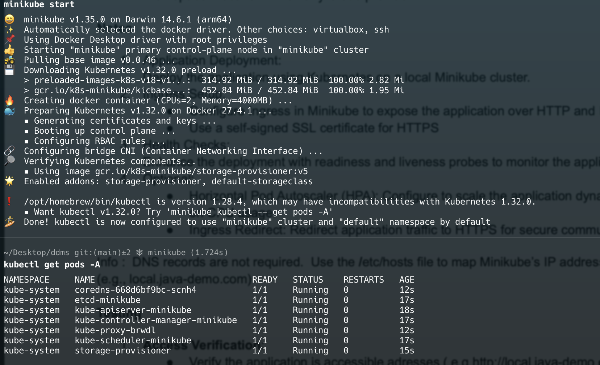
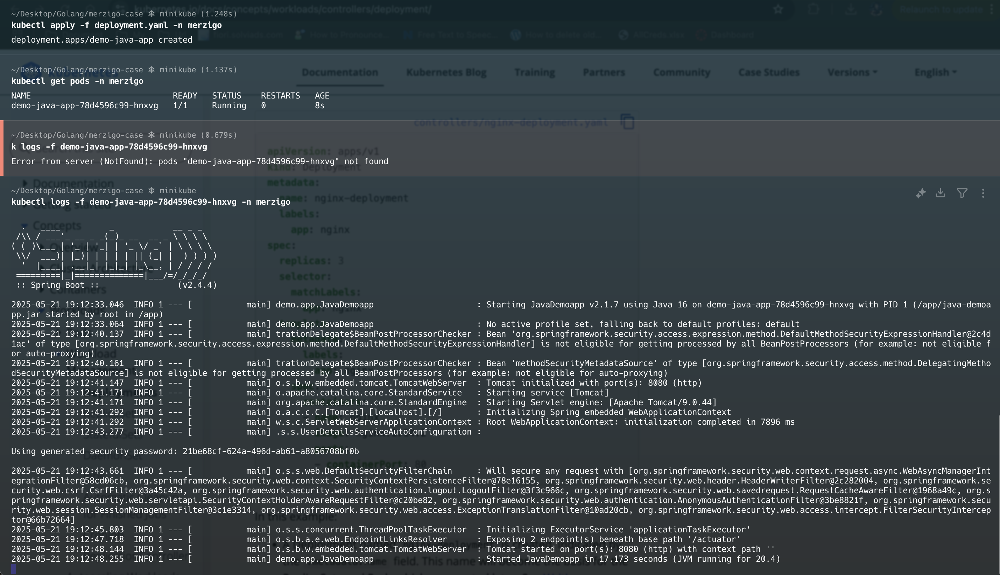
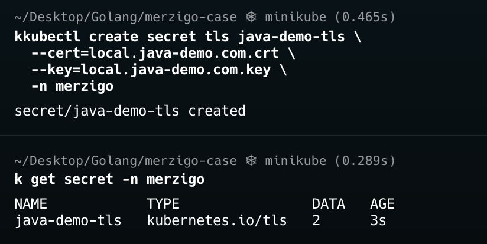
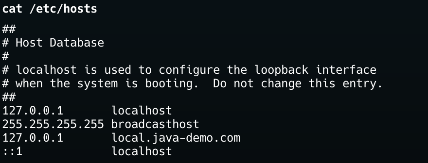
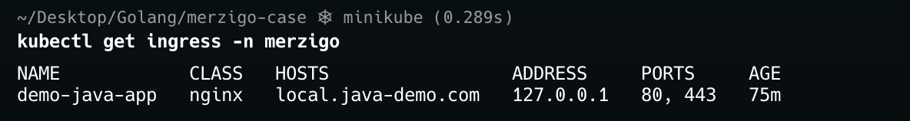
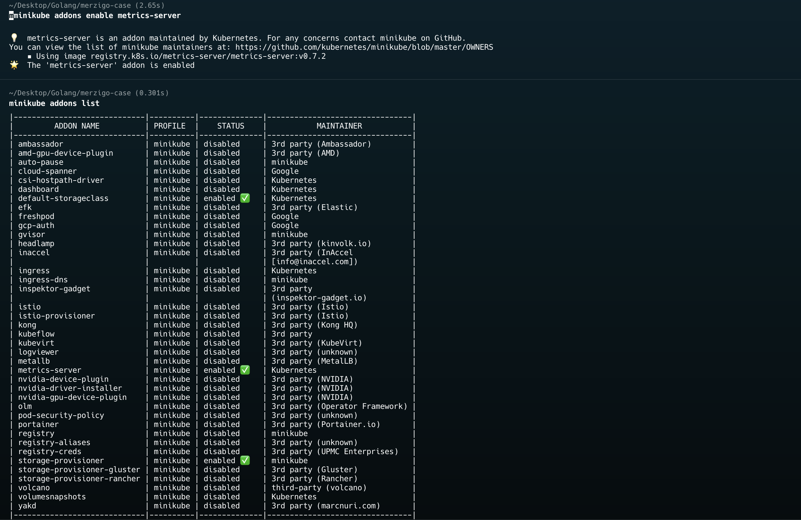
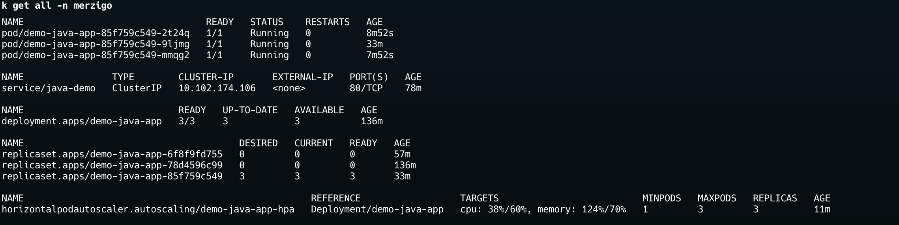
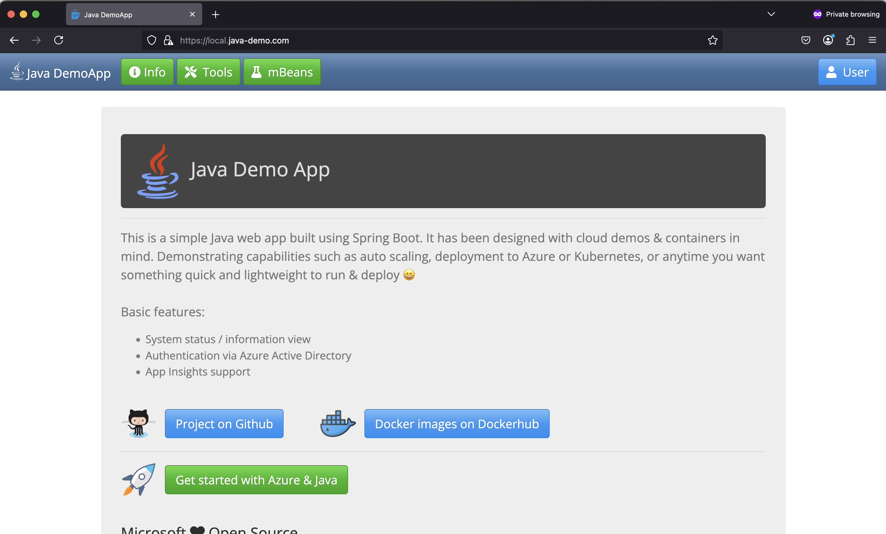

# DevOps Case

### Minikube Installation
[Installation Minikube](https://minikube.sigs.k8s.io/docs/start/?arch=%2Fmacos%2Farm64%2Fstable%2Fbinary+download)

- Installation minikube

```bash
curl -LO https://github.com/kubernetes/minikube/releases/latest/download/minikube-darwin-arm64
sudo install minikube-darwin-arm64 /usr/local/bin/minikube
```
- Start minikube cluster

```bash
minikube start
```
- Check version

```bash
minikube version
minikube version: v1.35.0
commit: dd5d320e41b5451cdf3c01891bc4e13d189586ed-dirty
```



### Application Deployment
- Created namespace and deployed java-demo-app.

[Deployment Yaml](https://kubernetes.io/docs/concepts/workloads/controllers/deployment/)
[Service Yaml](https://kubernetes.io/docs/concepts/services-networking/service/)
[Liveness Rediness Probe](https://kubernetes.io/docs/tasks/configure-pod-container/configure-liveness-readiness-startup-probes/)
[HPA](https://medium.com/@amirhosseineidy/how-to-make-a-kubernetes-autoscaling-hpa-with-example-f2849c7bbd0b)

```bash
kubectl create namespace merzigo
kubectl apply -f deployment.yaml -n merzigo
kubectl get pods -n merzigo
NAME                             READY   STATUS    RESTARTS   AGE
demo-java-app-78d4596c99-hnxvg   1/1     Running   0          8s
kubectl logs -f demo-java-app-78d4596c99-hnxvg -n merzigo

kubectl apply -f service.yaml -n merzigo
```




### Self-Signed Certificate Generation

- Create self-signed certificate
[Self-signed Certificate](https://stackoverflow.com/questions/10175812/how-can-i-generate-a-self-signed-ssl-certificate-using-openssl)

```bash
openssl req -x509 -newkey rsa:4096 -sha256 -days 365 \
  -nodes -keyout local.java-demo.com.key -out local.java-demo.com.crt \
  -subj "/CN=local.java-demo.com" \
  -addext "subjectAltName=DNS:local.java-demo.com,DNS:*.local.java-demo.com,IP:192.168.49.2"
```

### Ingress and TLS Configuration



- Create TLS secret

```bash
kubectl create secret tls java-demo-tls \
  --cert=local.java-demo.com.crt \
  --key=local.java-demo.com.key \
  -n merzigo
```

- Update /etc/hosts

```bash
127.0.0.1 local.java-demo.com
```



- Install Ingress-Nginx controller

[Installation Ingress-Nginx Controller](https://spacelift.io/blog/kubernetes-ingress)

```bash
kubectl apply -f https://raw.githubusercontent.com/kubernetes/ingress-nginx/controller-v1.3.0/deploy/static/provider/cloud/deploy.yaml
kubectl get pods --namespace ingress-nginx
NAME                                        READY   STATUS      RESTARTS   AGE
ingress-nginx-admission-create-qmkv5        0/1     Completed   0          151m
ingress-nginx-admission-patch-xg5b9         0/1     Completed   0          151m
ingress-nginx-controller-85f84bf86c-nvrsj   1/1     Running     0          151m
```

```bash
kubectl apply -f ingress.yaml -n merzigo
kubectl get ingress -n merzigo
```


### HPA and Metrics Server

- Deploy HPA

```bash
kubectl apply -f hpa.yaml -n merzigo
kubectl get hpa -n merzigo
NAME                REFERENCE                  TARGETS                                     MINPODS   MAXPODS   REPLICAS   AGE
demo-java-app-hpa   Deployment/demo-java-app   cpu: <unknown>/60%, memory: <unknown>/70%   1         3         0          14s
```
- The reason it's showing as "Unknown" is because the metrics server is not enabled in Minikube.

- Enable the metrics server
```bash
minikube addons list
minikube addons enable metrics-server
```


- All services and resources running



- Check node details

```bash
k get nodes -o wide
NAME       STATUS   ROLES           AGE   VERSION   INTERNAL-IP    EXTERNAL-IP   OS-IMAGE             KERNEL-VERSION     CONTAINER-RUNTIME
minikube   Ready    control-plane   34m   v1.32.0   192.168.49.2   <none>        Ubuntu 22.04.5 LTS   6.10.11-linuxkit   docker://27.4.1
```

### Testing and Results

- Minikube tunnel;
[Minikube Tunnel](https://minikube.sigs.k8s.io/docs/commands/tunnel/)

- Start the Minikube tunnel to expose services on privileged ports

```bash
sudo minikube tunnel
Password:
✅  Tunnel successfully started

📌  NOTE: Please do not close this terminal as this process must stay alive for the tunnel to be accessible ...

❗  The service/ingress ingress-nginx-controller requires privileged ports to be exposed: [80 443]
🔑  sudo permission will be asked for it.
🏃  Starting tunnel for service ingress-nginx-controller.
❗  The service/ingress demo-java-app requires privileged ports to be exposed: [80 443]
🔑  sudo permission will be asked for it.
🏃  Starting tunnel for service demo-java-app.
```

- Testing Application in Browser




### Presentation

- **Minikube Setup:** Installed and started Minikube on macOS.

- **Application Deployment:** Created `merzigo` namespace and deployed the Java demo app with probes.

- **Ingress Configuration:** Installed ingress-nginx, created a self-signed TLS certificate and secret, and exposed app HTTPS using Ingress.

- **Testing & Validation:** Verified access to `https://local.java-demo.com` browser after setting up `/etc/hosts` and running `minikube tunnel`.

- **Challenges:**
  - I used the image `ghcr.io/benc-uk/java-demoapp:latest` from the [java-demo-app](https://github.com/benc-uk/java-demoapp) repository.
  - Liveness/Readiness probes triggered too early, causing the pod to restart before the app was ready.  
    Fixed by increasing initialDelaySeconds from 5 to 15 and rediness from 15 to 30 seconds.

  - HPA metrics showed as "unknown" initially — resolved by enabling the metrics-server. 

  - /etc/hosts was initially pointing to the Minikube IP `192.168.49.2`, but Ingress with `minikube tunnel` listens on `127.0.0.1`.  
    Fixed by updating entry to `127.0.0.1 local.java-demo.com`.